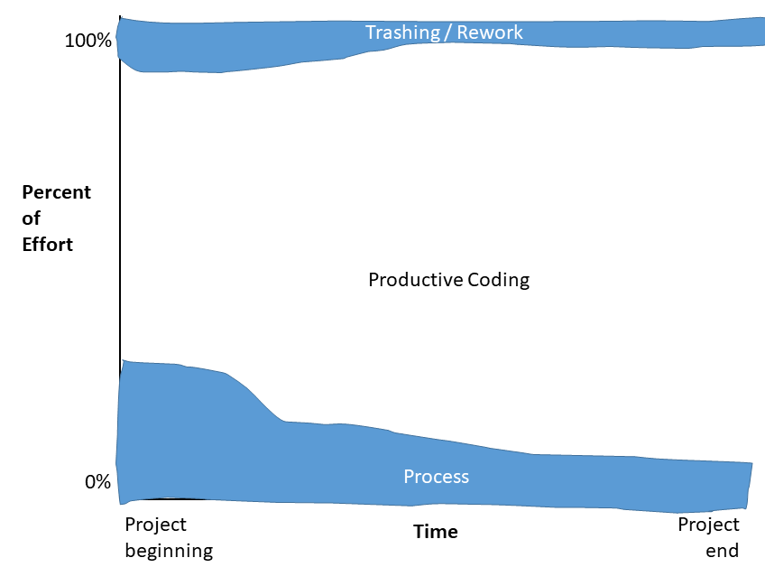
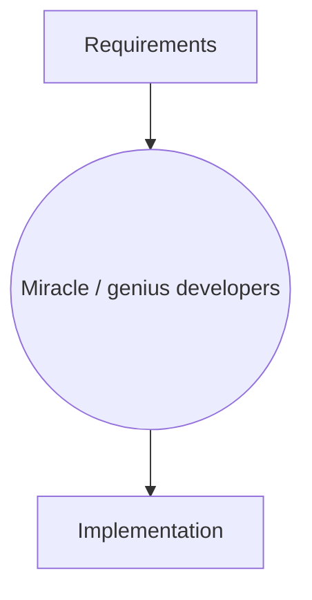
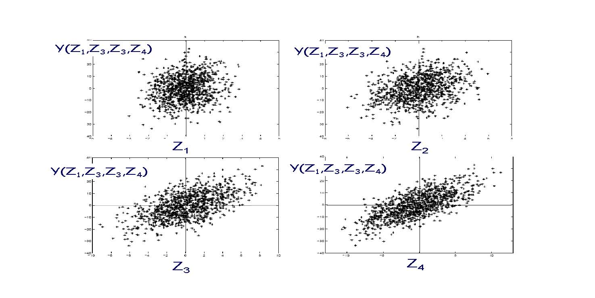
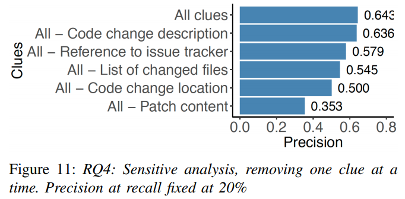
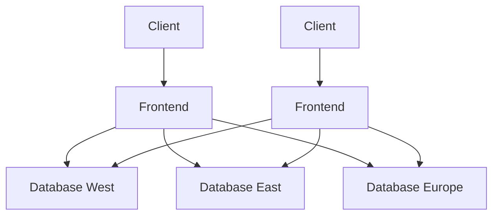
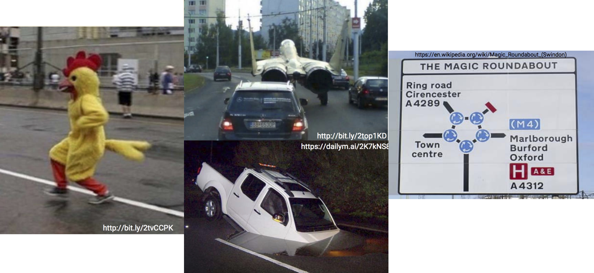
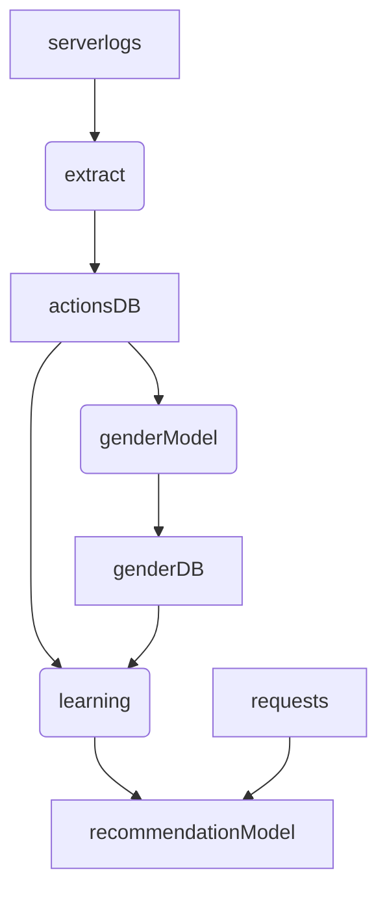
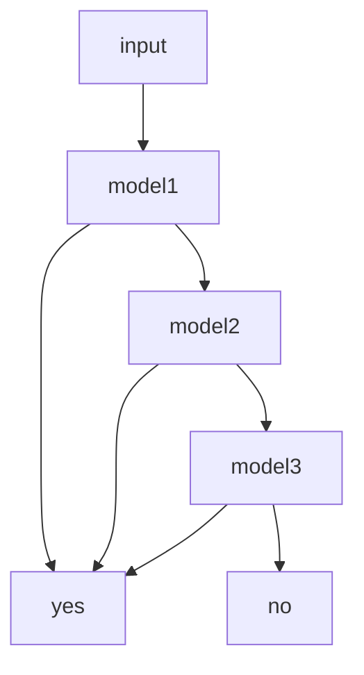
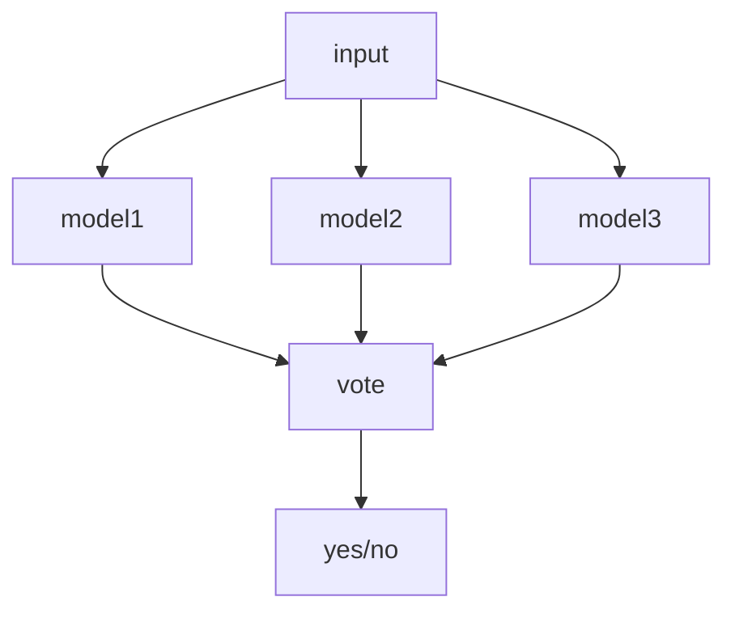
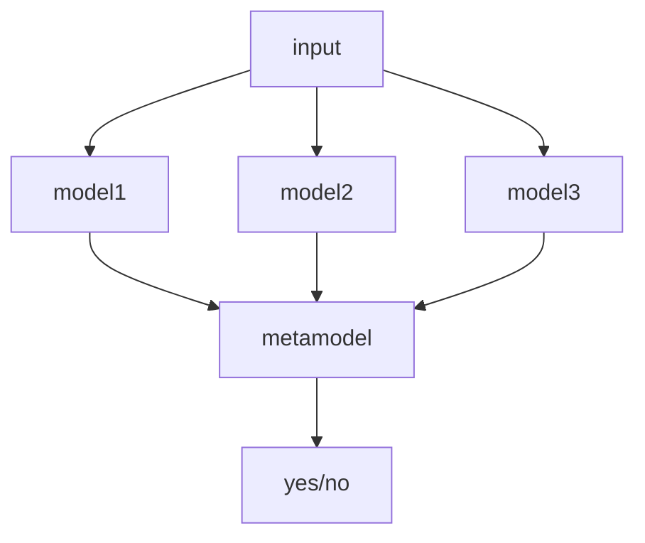

# Overview & Summary 

## 287 slides in 40 min

Christian Kaestner and Eunsuk Kang


---
# Introduction and Motivation

Christian Kaestner and Eunsuk Kang

----

## Learning Goals

* Explain the typical machine-learning process
* Illustrate the challenges in engineering an AI-enabled system beyond accuracy
* Summarize the respective goals and challenges of software engineers vs data scientists


----

# Disclaimer: New Class

----

# Case Study: The Transcription Service Startup


----

## Likely challenges?

<!-- discussion -->

----

## Garvin’s eight categories of product quality

* Performance
* Features
* Reliability
* Conformance
* Durability
* Serviceability
* Aesthetics
* Perceived Quality


----

# Correctness and Specifications

***

# Deductive vs. Inductive Reasoning

----

## Who is to blame?

```java
Algorithms.shortestDistance(g, "Tom", "Anne");

> ArrayOutOfBoundsException
```

```java
Algorithms.shortestDistance(g, "Tom", "Anne");

> -1
```

----

## System decomposition with interfaces

```java
/*@ requires amount >= 0;
    ensures balance == \old(balance)-amount &&
            \result == balance;
@*/
public int debit(int amount) {
    ...
}
```
(JML specification in Java, pre- and postconditions)

```java
/**
  * Calls the <code>read(byte[], int, int)</code> overloaded [...]
  * @param buf The buffer to read bytes into
  * @return The value retured from <code>in.read(byte[], int, int)</code>
  * @exception IOException If an error occurs
  */
public int read(byte[] buf) throws IOException
{
    return read(buf, 0, buf.length);
}
```
(textual specification with JavaDoc)

----

## Specifications in Machine Learning?

```java
/**
  ????
*/
String transcribe(File audioFile);
```

```java
/**
  ????
*/
List<Product> suggestedPurchases(List<Product> pastPurchases);
```


----

## Deductive Reasoning

* Combining logical statements following agreed upon rules to form new statements
* Proving theorems from axioms
* From general to the particular
* *mathy reasoning, eg. proof that π is irrational*
* 
* Formal methods, classic rule-based AI systems, expert systems

<!-- split -->

## Inductive Reasoning

* Constructing axioms from observations
* Strong evidence suggests a rule
* From particular to the general
* *sciency reasoning, eg. finding laws of nature*
* 
* Most modern machine learning systems, statistical learning


----

## Shift in Design Thinking

From deductive reasoning to inductive reasoning

From clear specifications to goals

From guarantees to best effort

**What does this mean for software engineering? For correctness of AI-enabled systems? For testing?**


----

# Technical Debt

> "Machine learning: The high interest credit card of technical debt" -- [Sculley et al. 2014](https://storage.googleapis.com/pub-tools-public-publication-data/pdf/43146.pdf)


----

[](https://www.monkeyuser.com/2018/tech-debt/) 
<!-- .element: class="stretch" -->


----

# Individual Assignment 1: Case Study on Malicious Ad Detection


---


# Components of an AI-Enabled System

Eunsuk Kang

<!-- references -->

Required reading: Hulten, Geoff. "Building Intelligent Systems: A Guide to Machine Learning Engineering." (2018), Chapters 2, 5, and 20.

----

# Learning Goals

* Understand when (not) to use AI
* Understand the major components of a typical AI-enabled system and design
  decisions to be made
* Understand the major steps in a typical ML pipeline and their goals

----

# When to use AI?

# ~~For everything!~~


<!-- .element: class="stretch" -->

----

## Use of AI?


<!-- .element: class="stretch" -->

----


## Components of an AI-Enabled System

* Objectives: What is the system trying to achieve?
* Experience: What does it allow users to do? How does it receive
feedback?
* Intelligence: How does it achieve its objectives?
* Orchestration: How is everything put together? How does it evolve
over time?

----
## Case Study: Safe Browsing Feature


----
## Presenting Intelligence

* Automate: Take action on user's behalf
* Prompt: Ask the user if an action should be taken
* Organize: Display a set of items in an order
* Annotate: Add information to a display
* Q. What are design choices for safe browsing?

----
## Collecting Feedback


----
## Controling User Interactions


----
## Typical Machine Learning Pipeline


Figure by [Semi Koen](https://towardsdatascience.com/not-yet-another-article-on-machine-learning-e67f8812ba86)


---
# Software Engineering Bootcamp

Christian Kaestner

<!-- references -->

Required reading: 
Mary Shaw (ed), [Software Engineering for the 21st Century: A basis for rethinking the curriculum](http://ra.adm.cs.cmu.edu/anon/usr0/anon/usr/ftp/isri2005/CMU-ISRI-05-108.pdf), 2015, Sec 1-3

Notes:

Most students will know this; this is a refresher and provides an overview. This is the bare minimum of software engineering practices a la https://software-carpentry.org/

----

# Learning Goals

* Recognize the importance of process
* Describe common agile practices and their goals
* Apply basic software engineering practices during coding (including version control, documentation, issue tracking)
* Use milestones for planning and progress measurement
* Describe common qualities of interest and how to measure them


----

# Scenario: Preventing Wildlife Poaching


<!-- .element: class="stretch" -->

----

## A Simple Process

1. Discuss the software that needs to be written
2. Write some code
3. Test the code to identify the defects
4. Debug to find causes of defects
5. Fix the defects
6. If not done, return to step 1

----
Hypothesis: Process increases flexibility and efficiency +  Upfront investment for later greater returns



----


## Abstraction & Automation

Avoid repetition:

Code clone ▶ Method ▶ Library 

Similar problems, programs ▶ Frameworks, Configurations, Product Lines

Data gathering ▶ List comprehensions ▶ SQL

Command line steps ▶ Compilers and code generators ▶ Build systems

Manual testing ▶ Unit testing ▶ Continuous integration and deployment

Code inspection ▶ Static analysis

Manual issue tracking ▶ Issue tracking systems ▶ Bots and AI

----
## Version control


----

## Release management


----

## Versioning in AI-Enabled Systems?

<!-- discussion -->


----
## Test automation

```java
@Test
public void testSanityTest(){
    //setup
    Graph g1 = new AdjacencyListGraph(10);
    Vertex s1 = new Vertex("A");
    Vertex s2 = new Vertex("B");
    //check expected behavior
    assertEquals(true, g1.addVertex(s1));
    assertEquals(true, g1.addVertex(s2));
    assertEquals(true, g1.addEdge(s1, s2));
    assertEquals(s2, g1.getNeighbors(s1)[0]);
}
```


----

## Test Coverage


----

## Continuous Integration


----

## Requirements

> Requirements say what the system will do (and not how it will do it).

-

> The hardest single part of building a software system is deciding precisely what to build. 
> No other part of the conceptual work is as difficult as establishing the detailed technical requirements ... 
> No other part of the work so cripples the resulting system if done wrong. 
> No other part is as difficult to rectify later.     — Fred Brooks

----

## How to measure ...

* Performance
* Extensibility
* Accuracy
* Portability
* Developer productivity
* Fairness
* Operation cost

----
# Agile Practices in a Nutshell
----


<!-- .element: class="stretch" -->

([CC-BY-SA-2.5](https://commons.wikimedia.org/wiki/File:Waterfall_model.png))

----
## Agile Manifesto

> Individuals and interactions ▶ processes and tools
> Working software ▶ comprehensive documentation
> Customer collaboration ▶ contract negotiation
> Responding to change ▶ following a plan


Agile: A project management approach that seeks to respond to change and unpredictability, primarily using incremental, iterative work sequences (often called “sprints”) + a collection of practices to facility that approach.


----

# Assignment G1

* Group assignment, instructor assigned teams
* "Simple" modeling task
* Data provided through Kafka and APIs
* Team choses tools and languages


---

# Challenges and Measurements

Eunsuk Kang

<!-- references -->

Readings: D. Sculley et al. "Hidden Technical Debt in Machine Learning
Systems" (2015) 

Hulten, Geoff. "Building Intelligent Systems: A Guide to Machine
Learning Engineering" (2018), Chapter 4.

----
# Learning Goals

* Understand:
  * Challenges in building AI-based systems
  * Key differences from traditional software
  * Use of measurements in AI-based systems 
  * Difficulty and validity of measurements
  * Limitations and risks of decisions and incentives based
on measurements


----
## Traditional Programming vs ML


----
## Complexity in Engineering Systems


* Automobile: ~30,000 parts; Airplane: ~3,000,000 parts
* MS Office: ~ 40,000,000 LOCs; Debian: ~ 400,000,000 LOCs

### Q. How do we build such complex systems?
 
----
## Contracts in ML?


**Q. Is this the same kind of contract as in software?**

----
## (Lack of) Modularity in ML


## Concept Drifts

## Feedback loops


----
## Example: Crime Prediction

* Use past data to predict crime rates 
* Police increases the frequency of patrol in area X
* More arrested made in area X
* New crime data fed back to the model
* Repeat


----
# Introduction to Measurements

----
##  Measurement Scales 


----
# Challenges in Measurements

## The streetlight effect

* A type of _observational bias_
* People tend to look for something where it’s easiest to do so.


----
## Risks with Measurements

* Bad statistics: A basic misunderstanding of measurement theory and what is being measured.
* Bad decisions: The incorrect use of measurement data, leading to unintended side effects.
* Bad incentives: Disregard for the human factors, or how the cultural change of taking measurements will affect people.


----
##  Correlation vs Causation


----
## Confounding Variables


* If you want to show correlation between X and Y:
  * Identify potential confounding variables 
  * Control for those variables during measurement
* Examples
  * Drink coffee => Pancreatic cancer?
  * Degree from high-ranked schools => Higher-paying jobs?
  


---

# Requirements and Risks

Eunsuk Kang

<!-- references -->

Required reading: Hulten, Geoff. "Building Intelligent Systems: A
Guide to Machine Learning Engineering." (2018), Chapters 6, 7, and 24.

----
# Learning Goals

* Understand the importance of requirements in software engineering.
* Understand the role of environmental assumptions in establishing requirements.
* Understand ways in which mistakes in an AI-based system can undermine
  a requirement.
* Identify and evaluate risks in AI systems using fault tree analysis.


----

## Requirements

Describe what the system will do (and not how it will do them)


<!-- .element: class="stretch" -->

----
## Types of Requirements

* Functional requirements
  * What the system should do in terms of functionality
  * Input & output, response to events
* Quality (non-functional) requirements
  * How well the system delivers its functionality
  * Performance, reliability, security, safety, availability...


----
## Machine vs World


----
## What is Risk Analysis?

*  What can possibly go wrong in my system, and what are potential 
impacts on system requirements?
* Risk = Likelihood * Impact
* A number of methods:
  * Failure mode & effects analysis (FMEA)
  * Hazard analysis
  * Why-because analysis
  * Fault tree analysis (FTA) <= Today's focus!
  * ...
  
----
## Fault Tree Analysis (FTA)

* Fault tree: A top-down diagram that displays the relationships
between a system failure (i.e., requirement violation) and its potential causes.  
  * Identify sequences of events that result in a failure
  * Prioritize the contributors leading to the failure
  * Inform decisions about how to (re-)design the system
  * Investigate an accident & identify the root cause 
* Often used for safety & reliability, but can also be used for
other types of requirement (e.g., poor performance, security attacks...)


----

# Individual Assignment 2: Fault Tree Analysis of Uber Crash


---

# Trade-offs among AI Techniques

Eunsuk Kang

<!-- references -->

Required reading: Hulten, Geoff. "Building Intelligent Systems: A
Guide to Machine Learning Engineering." (2018), Chapters 6, 7, and 24.

----
# Learning Goals

* Understand the major types of AI tasks and corresponding techniques
* Understand and compare the attributes of major learning methods
* Organize and prioritize the relevant qualities of concern for a given project
* Plan and execute an evaluation alternative learning methods for a given purpose


----
# Selection

### How do I decide which ML method to use for my project?

----
## ML Methods Today


----
## ML Tasks

* Classification
* Regression
* Clustering
* (Dimensionality reduction)
* (Reinforcement learning)
* (Active learning)
* ...


----
## Classification


* Which one of the given categories does a new
observation belong to?
	* e.g., e-mail spam filter, pedestrian detection
	* Output is a **categorical** value

----
## Regression


* What is the estimated value for an output given an observation?
	* e.g., weather forecasting, sales prediction
	* Output is a **numerical/continuous** value

----
## Clustering


* What is the best way to divide a set of observations into
distinct groups?
	* An example of *unsupervised learning*: Input data aren't labeled
	* Output is a set of *categories*
	* e.g., human genetic clustering, social network analysis

<!-- references -->

_An Exploration of Social Identity: The Geography and Politics of
News-Sharing Communities in Twitter_, Herdagdelen et al. (2012)


----
## ML Attributes 

* Type of ML task: Classification, regression, or clustering?
* Type of training/input data required
  * Labeled vs not labeled
  * Categorical vs numerical
* Accuracy: Precision & recall (for classification), errors (regression)
* Interpretability: Why did the model produce output X?
* Problem complexity
   * Linear vs. non-linear relationship between input & output variables
   * Number of features (dimensionality)
* Training costs
  * Amount of training data required to reach desired accuracy
  * Training time
* Model size: Can you store all your model in memory?
* Incrementality: Can you improve the model by gradually adding more data?
* Inference time: How long does it take for the model to make a decision?

----
## Which Method?

### Pedestrian detection


Linear regression, decision tree, neural network, or k-NN?

----
## Trade-offs: Cost vs Accuracy


_"We evaluated some of the new methods offline but the additional
accuracy gains that we measured did not seem to justify the
engineering effort needed to bring them into a production
environment.”_

<!-- references -->

_Netflix Recommendations: Beyond the 5 stars_, Amatriain & Basilico,
Netflix Technology Blog (2012).


----
## Trade-offs: Accuracy vs Interpretability


<!-- references -->

_Overcoming the Barriers to Production-Ready Machine Learning
Workflows_, Bloom & Brink, O'Reilly Strata Conference (2014).

----

## Group Assignment 2: Tradeoff Analysis


---

# Software Architecture of AI-enabled Systems

Christian Kaestner

<!-- references -->

Required reading: 
* Rick Kazman, Paul Clements, and Len Bass. [Software architecture in practice.](https://www.oreilly.com/library/view/software-architecture-in/9780132942799/?ar) Addison-Wesley Professional, 2012, Chapter 1
* Hulten, Geoff. "[Building Intelligent Systems: A Guide to Machine Learning Engineering.](https://www.buildingintelligentsystems.com/)" Apress, 2018, Chapter 13.


----

# Learning Goals


* Understand important quality considerations when using ML components
* Follow a design process to explicitly reason about alternative designs and their quality tradeoffs
* Create architectural models to reason about relevant characteristics
* Gather data to make informed decisions about what ML technique to use and where and how to deploy it

* Identify to what degree isolating an AI component is possible and benefitial
* Critique the decision of where an AI model lives (e.g., cloud vs edge vs hybrid), considering the relevant tradeoffs 
* Deliberate how and when to update models and how to collect telemetry

----

# Software Architecture 



----
## Software Architecture

> The software architecture of a program or computing system is the **structure or structures** of the system, which comprise **software elements**, the ***externally visible properties*** of those elements, and the relationships among them.
> -- [Kazman et al. 2012](https://www.oreilly.com/library/view/software-architecture-in/9780132942799/?ar)


----

## Case Study: Twitter


----
## Analysis-Specific Abstractions


Notes: Fire zones of Pittsburgh. Various use cases, e.g., for city planners.

----
## Case Study: Augmented Reality Translation


----
# Architectural Decision: Selecting AI Techniques

What AI techniques to use and why? Tradeoffs?


----
## Where Should the Model Live?

* Glasses
* Phone
* Cloud

What qualities are relevant for the decision?

<!-- split -->


----
## Telemetry Design

How to evaluate mistakes in production?


----
## The Right and Right Amount of Telemetry

Purpose:
* Monitor operation
* Monitor mistakes (e.g., accuracy)
* Improve models over time (e.g., detect new features)

Challenges:
* too much data
* no/not enough data
* hard to measure, poor proxy measures
* rare events
* cost
* privacy

----
# Architectural Decision: Updating Models

* Models are rarely static outside the lab
* Data drift, feedback loops, new features, new requirements
* When and how to update models?
* How to version? How to avoid mistakes?

----
## Individual Assignment: Architecture Reasoning for Dashcam System


---

# Model Quality

Christian Kaestner

<!-- references -->

Required reading: 
* Hulten, Geoff. "[Building Intelligent Systems: A Guide to Machine Learning Engineering.](https://www.buildingintelligentsystems.com/)" Apress, 2018, Chapters 15 (Intelligent Telemetry) and 19 (Evaluating Intelligence).

----

# Learning Goals

* Identify and describe the goals of an AI component and define outcome quality measures
* Explain the limits of evaluating model quality on a static dataset and design telemetry for assessment in production
* Assess model quality with suitable measures and compare quality of multiple models
* Design a test suite for assuring model quality
* Develop automated solutions to evaluate and monitor model quality

----
## Preliminaries: Model Testing

*model:* $\overline{X} \rightarrow Y$

*test:* sets of $(\overline{X}, Y)$ pairs indicating desired outcomes for select inputs

For our discussion: any form of model, including machine learning models, symbolic AI components, hardcoded heuristics, composed models, ...


----
## Preliminaries: ML Algorithm Quality vs Model Quality vs System Quality

We focus on the quality of the produced model, not the algorithm used to learn the model

i.e. assuming *Decision Tree Algorithm* and feature extraction are correctly implemented (according to specification), is the model learned from data any good?


The model is just one component of the entire system.


----
## System Goals and Model Quality?

What are the overall goals of the system?

Sketch a system architecture with relevant AI components. How do those components support the system goals?

What are quality goals for the models?

<!-- colstart -->

<!-- col -->

<!-- colend -->


----
## Confusion/Error Matrix

| | **Actually A** | **Actually B** | **Actually C** |
| :--- | --- | --- | --- |
|**AI predicts A** | **10** | 6 | 2 |
|**AI predicts B** | 3 | **24**  | 10 |
|**AI predicts C** | 5 | 22 | **82** |

Accuracy = correct predictions (diagonal) out of all predictions

Example's accuracy 
        = $\frac{10+24+82}{10+6+2+3+24+10+5+22+82} = .707$


----
## Measures

Measuring success of correct classifications (or missing results):
* Recall = TP/(TP+FN) 
    * aka true positive rate, hit rate, sensitivity; *higher is better*
* False negative rate = FN/(TP+FN) = 1 - recall 
    * aka miss rate; *lower is better*

*** 

Measuring rate of false classifications (or noise):
* Precision = TP/(TP+FP)
    * aka positive predictive value; *higher is better*
* False positive rate = FP/(FP+TN) 
    * aka fall-out; *lower is better*
<!-- * False discovery rate = FP/(FP+TP) = 1 - precision -->

***

Combined measure (harmonic mean):

F1 score = $2 \frac{recall*precision}{recall+precision}$ 


----

[](https://en.wikipedia.org/wiki/Precision_and_recall#/media/File:Precisionrecall.svg)


(CC BY-SA 4.0 by [Walber](https://en.wikipedia.org/wiki/Precision_and_recall#/media/File:Precisionrecall.svg))


----
## False positives and false negatives equally bad? 

Consider: 
* Identifying soccer players
* Suggesting products to buy on e-commerce site
* Identifying human trafficking at the border
* Predicting high demand for ride sharing services
* Recognizing cancer 

No answer vs wrong answer?


----
## Distribution of Mistakes

> some random mistakes vs rare but biased mistakes?

* A system to detect when somebody is at the door that never works for people under 5ft (1.52m)
* A spam filter that deletes alerts from banks

Case Study: http://pic.twitter.com/ZJ1Je1C4NW

**Consider separate evaluations for important subpopulations; monitor mistakes in production**


----
## Area Under the Curve

Turning numeric prediction into classification with threshold ("operating point")


----

# Measuring Generalization

## The Legend of the Failed Tank Detector

<!-- colstart -->

<!-- col -->

<!-- colend -->


----
## Overfitting/Underfitting

**Overfitting:** Model learned exactly for the input data, but does not generalize to unseen data (e.g., exact memorization)

**Underfitting:** Model makes very general observations but poorly fits to data (e.g., brightness in picture)

Typically adjust degrees of freedom during model learning to balance between overfitting and underfitting: can better learn the training data with more freedom (more complex models); but with too much freedom, will memorize details of the training data rather than generalizing


(CC SA 4.0 by [Ghiles](https://en.wikipedia.org/wiki/File:Overfitted_Data.png))


----
## Crossvalidation

* Repeated partitioning of a dataset in training and testing set
    - leave one out: single data point for evaluation
    - k-fold: one of k random partitions used for evaluation
    - Monte Carlo: random x% used for evaluation
* In each iteration, train and evaluate model
* Report average evaluation result

**Discuss benefits and problems**

----

## Test Automation for Model Quality

* Testing script
    * Existing model: Implementation to automatically evaluate model on labeled training set; multiple separate evaluation sets possible, e.g., for critical subcommunities or regressions
    * Training model: Automatically train and evaluate model, possibly using cross-validation; many ML libraries provide built-in support
    * Report accuracy, recall, etc. in console output or log files
    * May deploy learning and evaluation tasks to cloud services
    * Optionally: Fail test below quality bound (e.g., accuracy <.9; accuracy < accuracy of last model)
* Version control test data, model and test scripts, ideally also learning data and learning code (feature extraction, modeling, ...)
* Continuous integration tool can trigger test script and parse output, plot for comparisons (e.g., similar to performance tests)
* Optionally: Continuous deployment to production server

----
## Dashboards for Model Evaluation Results

[](https://eng.uber.com/michelangelo/)

<!-- references  -->

Jeremy Hermann and Mike Del Balso. [Meet Michelangelo: Uber’s Machine Learning Platform](https://eng.uber.com/michelangelo/). Blog, 2017

----

## Specialized CI Systems


<!-- references -->

Renggli et. al, [Continuous Integration of Machine Learning Models with ease.ml/ci: Towards a Rigorous Yet Practical Treatment](http://www.sysml.cc/doc/2019/162.pdf), SysML 2019

----
## Dashboards for Comparing Models


<!-- references -->

Matei Zaharia. [Introducing MLflow: an Open Source Machine Learning Platform](https://databricks.com/blog/2018/06/05/introducing-mlflow-an-open-source-machine-learning-platform.html), 2018

----

## Test Coverage for AI Components

**Open research problem**

No specifications -> No boundary conditions, no test classes

Various techniques to identify samples near decision boundaries

Coverage criteria for neural networks

Different test sets for different populations

----
# Model Assessment in Production

Ultimate held-out evaluation data: Unseen real user data

----


<!-- split -->


----
## Measuring Model Quality with Telemetry

* Telemetry can provide insights for correctness
    - sometimes very accurate labels for real unseen data
    - sometimes only mistakes
    - sometimes delayed
    - often just samples
    - often just weak proxies for correctness
* Often sufficient to approximate precision/recall or other measures
* Mismatch to (static) evaluation set may indicate stale or unrepresentative data
* Trend analysis can provide insights even for inaccurate proxy measures

----
## Engineering Challenges for Telemetry


----
## Engineering Challenges for Telemetry
* Data volume and operating cost
    - e.g., record "all AR live translations"?
    - reduce data through sampling
    - reduce data through summarization (e.g., extracted features rather than raw data; extraction client vs server side)
* Adaptive targeting
* Biased sampling
* Rare events
* Privacy


----
## Compare model quality against simpler models

* Random models (e.g., .5 probability cancer)
* Naive models (e.g., never cancer)
* Simple hardcoded heuristics (e.g., 6 connected pixels 50% darker than surrounding pixels)
* Simpler modeling technique (e.g., decision tree instead of DNN)
* State of the art technique (+ hyperparameter optimization)

*The new model should clearly outperform these to show value.*


---

# Experimentation

Christian Kaestner

<!-- references -->

Required reading: 
* Georgi Georgiev. [Statistical Significance in A/B Testing – a Complete Guide](http://blog.analytics-toolkit.com/2017/statistical-significance-ab-testing-complete-guide/). Blog post, 2018.

----

# Learning Goals

* Plan and execute experiments (chaos, A/B, ...) in production
* Conduct and evaluate multiple concurrent A/B tests in a system
* Examine experimental results with statistical rigor
* Perform sensitivity analysis in large configuration/design spaces

----
# Science


> The scientific method is an empirical method of acquiring knowledge that has characterized the development of science since at least the 17th century. It involves careful observation, applying rigorous skepticism about what is observed, given that cognitive assumptions can distort how one interprets the observation. It involves formulating hypotheses, via induction, based on such observations; experimental and measurement-based testing of deductions drawn from the hypotheses; and refinement (or elimination) of the hypotheses based on the experimental findings. -- [Wikipedia](https://en.wikipedia.org/wiki/Scientific_method)

----
## Excursion: The Seven Years' War (1754-63)

Britain loses 1,512 sailors to enemy action...

...and almost 100,000 to scurvy


<!-- .element: class="stretch" -->


(American part of [Seven Years' War](https://en.wikipedia.org/wiki/Seven_Years%27_War) known as [French and Indian War](https://en.wikipedia.org/wiki/French_and_Indian_War))


----
## Controlled Experiment Design

Start with hypothesis

Goal: Testing the impact of independent variable X (treatment or no treatment) on outcome Y, ideally controlling all other influences that may affect Y

Setup: Diving test subjects into two groups: with X (treatment group) and without X (control group), observing outcomes Y

Results: Analyzing whether outcomes differ among the groups

*What are X, Y, and test subjects for the graduation and weather forecast research questions?*


----
## Confounds for Example Research Questions?
<!-- colstart -->

<!-- col -->

<!-- colend -->


----
# Offline Experimentation

## Data Science is Exploratory and Iterative


<!-- references -->
Philip Guo. [Data Science Workflow: Overview and Challenges](https://cacm.acm.org/blogs/blog-cacm/169199-data-science-workflow-overview-and-challenges/fulltext). BLOG@CACM, 2013

----
## Experimentation Challenges

* Notebooks allow lightweight experimentation, but 
    * do not track history or rationale
    * no easy merging
    * comparison of many experiments challenging
    * pervasive copy + paste editing
    * later cleanup often needed
* Experiments may be expensive (time + resources, learning + evaluation)
* Overfitting despite separate evaluation set
* Data versioning at scale

<!-- references -->

Further reading: Kery, M. B., Radensky, M., Arya, M., John, B. E., & Myers, B. A. (2018, April). [The story in the notebook: Exploratory data science using a literate programming tool](https://dl.acm.org/citation.cfm?id=3173748). In Proceedings of the 2018 CHI Conference on Human Factors in Computing Systems (p. 174). ACM.

----
# Sensitivity Analysis

<!-- references -->

Further reading: Saltelli, Andrea, et al. Global sensitivity analysis: the primer. John Wiley & Sons, 2008.


----
## Plotted Influence of 4 Parameters

100 random samples. Which parameter ($Z_1, Z_2, Z_3, Z_4$) has the most influence on $Y$?




----
## Exhaustive Search (Grid Search)

* Explore all combinations of all variations of all inputs
* Frequently used for hyperparameter optimization in small search spaces
* Exponential search space
* Covers all interactions, ideal for finding optimum
* Readily implemented in many frameworks
* Not feasible for most scenarios 

----
## One-at-a-time

* Sampling:
    * $S_0$ default assignment to all inputs
    * For each input, create one sample that differs from $S_0$ only in that input (or multiple)
* Compute influence as partial derivative or using linear regression
* Simple, fast, practical, but cannot discover interactions
*
* Useful also for *screening*: identifying few significant inputs

----
## Regression analysis

* Random sampling or other strategies
* Fit linear regression model over findings
    - optionally, use feature selection to keep model simple or explore interactions
    - e.g. $3·z_1+.2·z_3-14.2·z_3·z_4$
* Interpret sensitivity from model coefficients
* Simple, computationally efficient, but limited to linear relationships
*
* **General strategy: Replacing one model with a simpler, less accurate, but more explainable model.**

----
## Sensitivity Analysis for Duplicate PR Detector

* Project: ML classifier to detect duplicate pull requests on GitHub

<!-- colstart -->

<!-- col -->

<!-- colend -->

<!-- references -->
L. Ren, S. Zhou, C. Kästner, and A. Wąsowski. [Identifying Redundancies in Fork-based Development](https://www.cs.cmu.edu/~ckaestne/pdf/saner19.pdf). In Proceedings of the 27th IEEE International Conference on Software Analysis, Evolution and Reengineering (SANER), pages 230--241, 2019.

----

# Online Experimentation

## What if...?
 
* ... we hand plenty of subjects for experiments
* ... we could randomly assign subjects to treatment and control group without them knowing
* ... we could analyze small individual changes and keep everything else constant


▶ Ideal conditions for controlled experiments


----

## Implementing A/B Testing

* Implement alternative versions of the system
    * using feature flags (decisions in implementation)
    * separate deployments (decision in router/load balancer)
* Map users to treatment group
    * Randomly from distribution
    * Static user - group mapping
    * Online service (e.g., [launchdarkly](https://launchdarkly.com/), [split](https://www.split.io/))
* Monitor outcomes *per group*
    * Telemetry, sales, time on site, server load, crash rate
----

<!-- .element: class="stretch" --> 

----
## Comparing Distributions


----
## Challenges

* Tracking of experiments, versioning of modeling code *and* data
* Slow experiments, slow feedback cycles
* Many choices, many interactions
* Many one-off experiments, little merging
* Interaction with complex backends and datasets
*
* No standardized platforms

----
## Example: DVC 

```sh
dvc add images
dvc run -d images -o model.p cnn.py
dvc remote add myrepo s3://mybucket
dvc push
```

* Tracks models and datasets
* Splits learning into steps, incrementalization
* Orchestrates learning in cloud resources


https://dvc.org/


---

# Data Quality

Christian Kaestner

<!-- references -->

Required reading: Schelter, S., Lange, D., Schmidt, P., Celikel, M., Biessmann, F. and Grafberger, A., 2018. [Automating large-scale data quality verification](http://www.vldb.org/pvldb/vol11/p1781-schelter.pdf). Proceedings of the VLDB Endowment, 11(12), pp.1781-1794.

----

# Learning Goals

* Design and implement automated quality assurance steps that check data schema conformance and distributions 
* Devise thresholds for detecting data drift and schema violations
* Describe common data cleaning steps and their purpose and risks
* Evaluate the robustness of AI components with regard to noisy or incorrect data


----

# Data-Quality Challenges


----
## What makes good quality data?

* Accuracy
  * The data was recorded correctly.
* Completeness
  * All relevant data was recorded.
* Uniqueness
  * The entries are recorded once.
* Consistency
  * The data agrees with itself.
* Timeliness
  * The data is kept up to date.

----

# Data Cleaning


----
## Common Strategies

* Enforce schema constraints
  * e.g., delete rows with missing data or use defaults
* Explore sources of errors 
  * e.g., debugging missing values, outliers
* Remove outliers
  * e.g., Testing for normal distribution, remove > 2σ
* Normalization
  * e.g., range [0, 1], power transform
* Fill in missing values

----
## Data Schema

* Define expected format of data
  * expected fields and their types
  * expected ranges for values
  * constraints among values (within and across sources)
* Data can be automatically checked against schema
* Protects against change; explicit interface between components


----
## Example: Apache Avro

```json
{   "type": "record",
    "namespace": "com.example",
    "name": "Customer",
    "fields": [{
            "name": "first_name",
            "type": "string",
            "doc": "First Name of Customer"
        },        
        {
            "name": "age",
            "type": "int",
            "doc": "Age at the time of registration"
        }
    ]
}
```

----

## Data Drift & Model Decay

Data changes over time

* Structural drift
  * Data schema changes, sometimes by infrastructure changes
  * e.g., `4124784115` -> `412-478-4115`
* Semantic drift
  * Meaning of data changes, same schema
  * e.g., Netflix switches from 5-star to +/- rating, but still uses 1 and 5
* User/environment behavior changes
  * e.g., credit card fraud differs to evade detection
  * e.g., marketing affects sales of certain items
*
* **Other examples?**


----
## Detecting Data Drift

* Compare distributions over time (e.g., t-test)
* Detect both sudden jumps and gradual changes
* Distributions can be manually specified or learned (see invariant detection)

<!-- colstart -->

<!-- col -->

<!-- colend -->

----
## Data Linter at Google

* Miscoding
    * Number, date, time as string
    * Enum as real
    * Tokenizable string (long strings, all unique)
    * Zip code as number
* Outliers and scaling
    * Unnormalized feature (varies widely)
    * Tailed distributions
    * Uncommon sign
* Packaging
    * Duplicate rows
    * Empty/missing data


---

# Infrastructure Quality

Christian Kaestner

<!-- references -->

Required reading: Eric Breck, Shanqing Cai, Eric Nielsen, Michael Salib, D. Sculley. [The ML Test Score: A Rubric for ML Production Readiness and Technical Debt Reduction](https://research.google.com/pubs/archive/46555.pdf). Proceedings of IEEE Big Data (2017)

----

# Learning Goals

* Implement and automate tests for all parts of the ML pipeline
* Test for robustness
* Understand testing opportunities beyond functional correctness
* Automate test execution with continuous integration
* Understand the idea of chaos engineering


----
## Possible Mistakes in ML Pipelines

Danger of "silent" mistakes in many phases


<!-- references -->
Source: Eric Breck, Shanqing Cai, Eric Nielsen, Michael Salib, D. Sculley. [The ML Test Score: A Rubric for ML Production Readiness and Technical Debt Reduction](https://research.google.com/pubs/archive/46555.pdf). Proceedings of IEEE Big Data (2017)

----
## Possible Mistakes in ML Pipelines

Danger of "silent" mistakes in many phases:

* Dropped data after format changes
* Failure to push updated model into production
* Incorrect feature extraction
* Use of stale dataset, wrong data source
* Data source no longer available (e.g web API)
* Telemetry server overloaded
* Negative feedback (telemtr.) no longer sent from app
* Use of old model learning code, stale hyperparameter
* Data format changes between ML pipeline steps

----
## Unit Test, Integration Tests, System Tests


----
## Example: Mocking a DataCleaner Object

```java
DataTable getData(KafkaStream stream, DataCleaner cleaner) { ... }

@Test void test() {
    DataCleaner dummyCleaner = new DataCleaner() {
        boolean isValid(String row) { return true; }
        ...
    }
    DataTable output = getData(testStream, dummyCleaner);
    assert(output.length==10)
}
```


----
## Integration and system tests


----
## Feature Interaction Examples


----
## Nonlocal effects in ML systems?

<!-- discussion -->


----
## Feedback Loop Examples

* Users adjust how they speak to Alexa, Alexa trained on ...
* Model to suggest popular products makes products popular
* Model to predict crime influences where crime is enforced, influencing crime statistics
* Criminals adjust to fraud detection model, model adjusts to recent crime

----

## Test Error Handling


```java
@Test void test() {
    DataTable data = new DataTable();
    try {
        Model m = learn(data);
        Assert.fail();
    } catch (NoDataException e) { /* correctly thrown */ }
}
```


----
## Chaos Testing


<!-- references -->

http://principlesofchaos.org


---
# DevOps

Christian Kaestner

----
# Learning Goals

* Understand the challenges of delivering implementations into operations
* Deploy a service for models using container infrastructure
* Basic overview of key tools 
* Design and implement a canary infrastructure

----
# Dev vs. Ops


<!-- .element: class="stretch" -->


----
## Common Release Problems (Examples)

* Missing dependencies
* Different compiler versions or library versions
* Different local utilities (e.g. unix grep vs mac grep)
* Database problems
* OS differences
* Too slow in real settings
* Difficult to roll back changes
* Source from many different repositories
* Obscure hardware? Cloud? Enough memory?

----
# DevOps


----
## Heavy tooling and automation -- Examples

* Infrastructure as code — Ansible, Terraform, Puppet, Chef
* CI/CD — Jenkins, TeamCity, GitLab, Shippable, Bamboo, Azure DevOps
* Test automation — Selenium, Cucumber, Apache JMeter
* Containerization — Docker, Rocket, Unik
* Orchestration — Kubernetes, Swarm, Mesos
* Software deployment — Elastic Beanstalk, Octopus, Vamp
* Measurement — Datadog, DynaTrace, Kibana, NewRelic, ServiceNow


----
# Canary Releases


----
## Recall: Feature Flags

```
  if (features.for({user:currentUser}).
       isEnabled("showReallyBigCheckoutButton")) {
      return renderReallyBigCheckoutButton();
   } else {
      return renderDefaultCheckoutButton();
   }
```


----


<!-- references -->

CC BY-SA 4.0, [G. Détrez](https://en.wikipedia.org/wiki/Continuous_delivery#/media/File:Continuous_Delivery_process_diagram.svg)

----
## Containers

* Lightweight virtual machine
* Contains entire runnable software, incl. all dependencies and configurations
* Used in development and production
* Sub-second launch time
* Explicit control over shared disks and network connections

<!-- split -->


----

# Group Assignment: Infrastructure Deployment and Testing

Docker, Jenkins, Unit tests


----

# Group Assignment: Automated Model Updates

Canary testing and A/B testing


---

# Fairness in AI-Enabled Systems

Eunsuk Kang

<!-- references -->

Required reading: R. Caplan, J. Donovan, L. Hanson, J.
Matthews. "Algorithmic Accountability: A Primer", Data & Society
(2018).

----
# Learning Goals

* Understand the types of harm that can be caused by ML.
* Understand the sources of bias in ML.
* Discuss ways to reduce bias in training data. 

----
## Discrimination


* Population includes various minority groups
  * Ethnic, religious, medical, geographic 
* Protected by laws & policies
* __How do we monitor & regulate decisions made by ML__?


----
## Example: Recidivism


----
## Types of Harm on Society

* __Harms of allocation__: Withhold opportunities or resources
* __Harms of representation__: Reinforce stereotypes, subordination along
  the lines of identity

<!-- references -->

 “The Trouble With Bias”, Kate Crawford, Keynote@N(eur)IPS (2017).


----
## Case Study: College Admission


* Objective: Decide "Is this student likely to succeed"?
* Possible harms: Allocation of resources? Quality of service?
  Stereotyping? Denigration? Over-/Under-representation?


----
## Sources of Bias

* Skewed sample
* Tainted examples
* Limited features
* Sample size disparity
* Proxies

<!-- references -->

_Big Data's Disparate Impact_, Barocas & Selbst California Law Review (2016).


----
## Skewed Sample


* Initial bias in the data set, amplified through feedback loop
* Example: Crime prediction for policing strategy


----
## Types of Data Bias

* __Population bias__
* __Behavioral bias__
* Content production bias
* Linking bias
* Temporal bias

<!-- references -->

_Social Data: Biases, Methodological Pitfalls, and Ethical
Boundaries_, Olteanu et al., Frontiers in Big Data (2016).


---

Guest Lecture

## Software engineering for machine learning at Microsoft

Andy Begel


---

# Fairness: Definitions and Measurements

Eunsuk Kang

<!-- references -->

Required reading:"Fairness and Machine Learning" by Barocas, Hardt,
and Narayanan (2019), Chapter 1.

----
# Learning Goals

* Understand different definitions of fairness
* Discuss methods for measuring fairness


----
## Fairness: Definitions

* Fairness through Blindness
* Group fairness
* Equalized odds
* Predictive rate parity


----
## Fairness through Blindness


* Ignore/eliminate sensitive attributes from dataset
* __Q. Why is this potentially a bad idea__?
  * Sensitive attributes may be correlated with other features
  * Some ML tasks need sensitive attributes (e.g., medical diagnosis)


----
## Group Fairness

$P[R = 1 | A = a]  = P[R = 1 | A = b]$

* Also called _statistical parity_, _demographic parity_, or the
  _independence_ criterion
* Mathematically, $R \perp A$
  * Prediction must be independent of the sensitive attribute
* Example: The predicted rate of recidivism is the same across all races
  <!-- .element: class="fragment" -->
* Q. What are limitations of group fairness?
  <!-- .element: class="fragment" -->
  * Ignores possible correlation between $Y$ and $A$
    <!-- .element: class="fragment" -->
  * Rules out perfect predictor $R = Y$ when $Y$ & $A$ are correlated
  * Permits laziness: Intentionally give high ratings to
  random people in one group
    <!-- .element: class="fragment" -->
* Q. But does this mean group fairness should never be used?
  <!-- .element: class="fragment" -->

----
## Equalized Odds

$P[R=0∣Y=1,A=a] = P[R=0∣Y=1,A=b]$
$P[R=1∣Y=0,A=a] = P[R=1∣Y=0,A=b]$

* Also called the _separation_ criterion
* $R \perp A | Y$
  * Prediction must be independent of the sensitive attribute
  _conditional_ on the target variable


----
## Predictive Rate Parity

$P[Y=1∣R=1,A=a] = P[Y=1∣R=1,A=b]$
$P[Y=0∣R=0,A=a] = P[Y=0∣R=0,A=b]$

* Also called the _sufficiency_ criterion
* $Y \perp A | R$
  *  Target variable must be independent of the sensitive attribute
    _conditional_ on the prediction
* i.e., $R$ is alone sufficient to identify $Y$; no need to see $A$


----
## Can we achieve fairness during the learning process?

* Pre-processing:
  * Clean the dataset to reduce correlation between the feature set
    and sensitive attributes
* Training time constraint
  * ML is a constraint optimization problem (minimize errors)
  * Impose additional parity constraint into ML optimization process
* Post-processing
  * Adjust the learned model to be uncorrelated with sensitive attributes
* (Still active area of research! Many new techniques published each year)


----
## Trade-offs: Accuracy vs Fairness


* In general, accuracy is at odds with fairness
  * e.g., Impossible to achieve perfect accuracy ($R = Y$) while
  ensuring group parity

<!-- references -->

_Fairness Constraints: Mechanisms for Fair Classification_, Zafar et
al., AISTATS (2017).
  

----
## Requirements for Fair ML Systems

1. Identify all environmental entities
  * Consider all stakeholders, their backgrounds & characteristics
2. State requirement (REQ) over the environment
   * What functions should the system serve? Quality attributes?
   * But also: What kind of harms are possible & should be minimized?
   * Legal & policy requirements  


----

## Individual Assignment: Fairness Analysis of Credit Scoring Data   


---
# Engineering Ethics

Christian Kaestner

----
# Learning Goals

* Awareness of ethical issues in software engineering
* Reflection on decision making
* Awareness of professional codes
* Starting points to dig deeper

----
# Legal / Moral / Ethical

* *Morality* governs private, personal interactions
* *Ethics* governs professional interactions
* *Law* governs society as a whole, often dealing with interactions between total strangers

----
[](https://twitter.com/EmilyEAckerman/status/1186363305851576321)

----
## Les Paul Doodle


> “Update Jun 17: Wow—in just 48 hours in the U.S., you recorded 5.1 years worth of 
> music—40 million songs—using our doodle guitar. 
> And those songs were played back 870,000 times!“


----
# Unforseen Consequences?


<!-- references -->

Catie Keck. (https://gizmodo.com/lime-reportedly-pulls-glitchy-e-scooters-in-switzerland-1831704890). Gizmodo. 2019


----
# Engineering Ethics
## Medical, Legal, Business, Engineering Ethics

* Many fields have well-developed professional ethics
* Basic ethical duty to *“hold paramount the safety, health and welfare of the public”*

<!-- split -->

[](citicorp.jpg)

http://ethics.wikia.com/wiki/Citicorp_Fiasco


----
## Malpractice vs. Negligence


----
## Ethics for Software Engineers and Data Sciensts?

* Softare engineers often have large autonomy (e.g. push to production)
* Fast release cycles
* Time and budget pressures


---
# Scalable and Distributed Systems

> “Don’t run a distributed system until you absolutely have to.” — Denise Yu

Christian Kaestner

----
# Learning Goals

* Summarize the challenges of distributed systems
* Evaluate benefits and drawbacks of microservice architectures
* Diagnose bottlenecks with architectural modeling and performance analysis
* Plan for failure cases in a distributed systems
* Deploy models as a service

----
# Scaling Computations

<!-- colstart -->
Efficent Algorithms
<!-- col -->
Faster Machines
<!-- col -->
More Machines
<!-- colend -->


----
# Microservices 


----
## Example

[](https://github.com/dotnet-architecture/eShopOnContainers)

https://github.com/dotnet-architecture/eShopOnContainers

----
## Drawbacks

* Complexities of distributed systems
  * network latency, faults, inconsistencies
  * testing challenges
* Resource overhead, RPCs
* Shifting complexities to the network
* Operational complexity
* Frequently adopted by breaking down monolithic application
* HTTP/REST/JSON communication

Do microservices solve problems, or push them down the line?

----


----
## Common Distributed System Issues

* Systems may crash
* Messages take time
* Messages may get lost
* Messages may arrive out of order
* Messages may arrive multiple times
* Messages may get manipulated along the way
* Bandwidth limits
* Coordination overhead
* Network partition
* ...


----
## Performance Analysis

* What is the average waiting?
* How many customers are waiting on average? 
* How long is the average service time?
* What are the chances of one or more servers being idle? 
* What is the average utilization of the servers?
*
* Early analysis of different designs for bottlenecks
* Capacity planning


----
## Performance Monitoring of Distributed Systems

* Instrumentation of (Service) APIs
* Load of various servers
* Typically measures: latency, traffic, errors, saturation
* 
* Monitoring long-term trends
* Alerting
* Automated releases/rollbacks
* Canary testing and A/B testing


---

# Managing and Processing Large Datasets

Christian Kaestner

<!-- references -->

Required reading: Martin Kleppmann. [Designing Data-Intensive Applications](https://dataintensive.net/). OReilly. 2017. Chapter 1

----

# Learning Goals

* Organize different data management solutions and their tradeoffs
* Explain the tradeoffs between batch processing and stream processing and the lambda architecture
* Recommend and justify a design and corresponding technologies for a given system

----
# Case Study


----
## Replication vs Partitioning

<!-- discussion -->

----
## Partitioning

Divide data:

* Horizontal partitioning: Different rows in different tables; e.g., movies by decade, hashing often used
* Vertical partitioning: Different columns in different tables; e.g., movie title vs. all actors

**Tradeoffs?**




----
# Batch Processing

* Analyzing TB of data, typically distributed storage
* Filtering, sorting, aggregating
* Producing reports, models, ...

```sh
cat /var/log/nginx/access.log |
    awk '{print $7}' |
    sort |
    uniq -c |
    sort -r -n |
    head -n 5
```

----
## Dataflow Engines (Spark, Tez, Flink, ...)

* Single job, rather than subjobs
* More flexible than just map and reduce
* Multiple stages with explicit dataflow between them
* Often in-memory data
* Pluming and distribution logic separated

----
# Stream Processing

* Event-based systems, message passing style, publish subscribe


----
## Common Designs

Like shell programs: Read from stream, produce output in other stream. Loose coupling


----
## Event Sourcing

* Append only databases
* Record edit events, never mutate data
* Compute current state from all past events, can reconstruct old state
* For efficiency, take state snapshots
* Similar to traditional database logs

```text
createUser(id=5, name="Christian", dpt="SCS")
updateUser(id=5, dpt="ISR")
deleteUser(id=5)
```


----
## Benefits of Immutability (Event Sourcing)

* All history is stored, recoverable
* Versioning easy by storing id of latest record
* Can compute multiple views
* Compare *git*

> On a shopping website, a customer may add an item to their cart and then
> remove it again. Although the second event cancels out the first event from the point
> of view of order fulfillment, it may be useful to know for analytics purposes that the
> customer was considering a particular item but then decided against it. Perhaps they
> will choose to buy it in the future, or perhaps they found a substitute. This information is recorded in an event log, but would be lost in a database that deletes items
> when they are removed from the cart.

<!-- references -->

Source: Greg Young. [CQRS and Event Sourcing](https://www.youtube.com/watch?v=JHGkaShoyNs). Code on the Beach 2014 via Martin Kleppmann. Designing Data-Intensive Applications. OReilly. 2017.


----
# The Lambda Architecture


<!-- references -->
Source: [Textractor](https://commons.wikimedia.org/wiki/File:Diagram_of_Lambda_Architecture_(named_components).png) (CC BY-SA 4.0)


----
## Lambda Architecture and Machine Learning


* Learn accurate model in batch job
* Learn incremental model in stream processor

----

## Group Assignment: System Monitoring

Feedback loops, attacks, Lambda Architecture


---

# Safety

Eunsuk Kang

<!-- references -->

Required reading: _Ironies of Automation_, Lisanne Bainbridge (1983) 

----
# Learning Goals

* Understand major safety challenges in AI-enabled systems
* Discuss the benefits and limitations of hazard analysis techniques
* Discuss ways to design systems to be safe against potential failures

----
## What is Safety?

* Prevention of a system failure or malfunction that results in:
  * Death or serious injury to people
  * Loss or severe damage to equipment/property
  * Harm to the environment or society


----
## How did traditional vehicles become safe?


* National Traffic & Motor Safety Act (1966)
  * Mandatory design changes (head rests, shatter-resistant
  windshields, safety belts); road improvements (center lines,
  reflectors, guardrails)

----
## Challenge: Edge/Unknown Cases



* Gaps in training data; ML will unlikely to cover all unknown cases
* __Q. Why is this a unique problem for AI__? What about humans?

----
## What is Hazard Analysis?


* __Hazard__: A condition or event that may result in undesirable outcome
  * e.g., "Ego vehicle is in risk of a collision with another vehicle."
* __Safety requirement__: Intended to eliminate or reduce one or more hazards
  * "Ego vehicle must always maintain some minimum safe distance to the leading vehicle."
* __Hazard analysis__: Methods for identifying hazards & potential root causes 

----
## Review: Fault Tree Analysis (FTA)


* Top-down, __backward__ search method for root cause analysis
  * Start with a given hazard (top event), derive a set of component
    faults (basic events)
  * Compute minimum cutsets as potential root causes
  * __Q. But how do we identify relevant hazards in the first place?__

----
## Hazard and Operability Study (HAZOP)


* A __forward search__ method to identify potential hazards
* For each component, use a set of __guide words__ to generate
possible deviations from expected behavior
* Consider the impact of each generated deviation: Can it
  result in a system-level hazard?


----
## Elements of Safe Design

* __Assume__: Components will fail at some point
* __Goal__: Minimize the impact of failures on safety
* __Detection__
  * Monitoring
* __Control__
  * Graceful degradation (fail-safe)
  * Redundancy (fail over)
* __Prevention__
  * Decoupling & isolation


----
## Response: Graceful Degradation (Fail-safe)

<video>
    <source data-src="rc-car.mp4" type="video/mp4" />
</video>

* __Goal__: When a component failure occurs, continue to provide
  safety (possibly at reduced functionality and performance)
* Relies on a monitor to detect component failures
* Example: Perception in autonomous vehicles
  * If Lidar fails, switch to a lower-quality detector; be more
  conservative
  * __But what about other types of ML failures? (e.g., misclassification)__


---

# Security

Eunsuk Kang

<!-- references -->

Required reading: _Uncover Security Design Flaws Using The STRIDE
Approach_ by Hernan, Lambert, Ostwald, and Shostack (MSDN, 2007).

----
# Learning Goals

* Understand key ingredients to achieving security
* Understand the process of threat modeling
* Understand emerging threat models for AI-enabled systems

----
## Security Requirements


* "CIA triad" of information security
* __Confidentiality__: Sensitive data must be accessed by authorized users only
* __Integrity__: Sensitive data must be modifiable by authorized users only
* __Availability__: Critical services must be available when needed by clients


----
## What is Threat Modeling?

* Threat model: A profile of an attacker
  * __Goal__: What is the attacker trying to achieve?
  * __Capability__:
  * Knowledge: What does the attacker know?
  * Actions: What can the attacker do?
  * Resources: How much effort can it spend? 
  * __Incentive__: Why does the attacker want to do this?


----
## Architecture Diagram for Threat Modeling


* You can use any notation, as long as:
  * its constructs (e.g., boxes and lines) have clear meanings; use legend!
  * it clearly shows potentially malicious/untrusted agent(s) & interactions
    with the system


----
## ML Attacker Goal

* Confidentiality (privacy) attack
  * Infer a sensitive label for a data point (e.g., hospital record)
* Integrity attacks
  * Induce a model to misclassify data points from one class to another
  * e.g., Spam filter: Classify a spam as a non-spam
* Availability attacks
  * Reduce the accuracy of a model
  * Induce a model to misclassify many data points


----
## Poisoning Attack: Availability


* Availability: Inject mislabeled training data to damage model
quality
  <!-- .element: class="fragment" -->
  * 3% poisoning => 11% decrease in accuracy (Steinhardt, 2017)
* Attacker must have some access to the training set
    <!-- .element: class="fragment" -->
  * e.g., models trained on public data set (e.g., ImageNet)
* Example: Anti-virus (AV) scanner
  <!-- .element: class="fragment" -->
  * Online platform for submission of potentially malicious code
  * Some AV company (allegedly) poisoned competitor's model
  

----
## Evasion Attack (Adversarial Examples)


* Add noise to an existing sample & cause misclassification
* Attack at inference time
  * Typically assumes knowledge of the model (algorithm, parameters)
  * Recently, shown to be possible even when the attacker only has access to
    model output ("blackbox" attack)

<!-- references -->

_Accessorize to a Crime: Real and Stealthy Attacks on State-of-the-Art
Face Recognition_, Sharif et al. (2016).

----
## Secure Design Principles 

* Principle of Least Privilege
  * A component should be given the minimal privileges needed to fulfill its functionality
  * Goal: Minimize the impact of a compromised component
* Isolation
  * Components should be able to interact with each other no more than necessary
  * Goal: Reduce the size of trusted computing base (TCB) 
  * TCB: Components responsible for establishing a security requirement(s)
  * If any of TCB compromised => security violation
  * Conversely, a flaw in non-TCB component => security still preserved!
  * In poor system designs, TCB = entire system

----
## Individual Homework: Threat Modeling


---

# Process and Team Reflections

Christian Kaestner

<!-- references -->

Required reading: DeMarco and Lister. Peopleware: Productive Projects and Teams. Addison-Wesley, 3rd ed., 2013. Chapters 22, 23, and 28.

----

# Learning Goals

* Plan development activities in an inclusive fashion for participants in different roles
* Describe agile techniques to address common process and communication issues


----
## How to structure teams?

Banking app; 15 developers and data analysts

<!-- colstart -->

<!-- col -->

<!-- colend -->

----
## Mythical Man Month

> Brooks's law: Adding manpower to a late software project makes it later


1975, describing experience at 
IBM developing OS/360

----
## Process Costs


*n(n − 1) / 2* communication links


----
## Matrix Organization


----
## Conflicting Goals

* Software engineers vs Data scientists
* Software engineers vs Security specialists
* Data scientists vs Privacy lawyers

<!-- discussion -->


----
## Specialist Allocation (Organizational Architectures)

* Centralized: development teams consult with a core group of  specialists when they need help
* Distributed: development teams hire specialists to be a first-class member of the team
* Weak Hybrid: centralized group of specialists and teams with  critical applications hire specialists
* Strong Hybrid: centralized group of specialists and most teams also hire specialists

**Tradeoffs?**

----
# Team issues: Groupthink


----


----
## Groupthink and AI

* Fairness
* Safety requirements (e.g. Pitt delivery robot)
* Ethics

----
# Team issues: Social loafing


----
## Mitigation Strategies

* Involve all team members, colocation
* Assign specific tasks with individual responsibility
    * Increase identifiability
    * Team contracts, measurement
* Provide choices in selecting tasks
* Promote involvement, challenge developers
* Reviews and feedback
* Team cohesion, team forming exercises
* Small teams


----
## Motivation

Autonomy * Mastery * Purpose


---

# Usability

Eunsuk Kang

<!-- references -->

Required reading: Building Intelligent Systems by Geoff Hulten (2018),
Chapter 8.

----
# Learning Goals

* Understand key ingredients of usable experiences (UX)
* Discuss factors to consider when designing UX for AI-enabled systems

----

## Case Study: Voice-Controlled Intelligent Assistants


----
## Dimensions of Usability

* __Learnability__: How easy is it for users to accomplish tasks the first time?
* __Efficiency__: After learning, how efficiently can users perform the
  tasks?
* __Memorability__: Can users remember to perform the tasks after a period of
  not using the system?
* __Errors__: How often do users make errors, how severe are these errors, and how easily can they recover from the errors?
* __Satisfaction__: How pleasant is it to use the design?

<!-- references -->

https://www.nngroup.com/articles/usability-101-introduction-to-usability/


----
##  Interaction Cost for Intelligent Assistants


* Holy grail of UX design: Reduce interaction cost to zero
* Q. Is the cost actually smaller than in physical interfaces?


----
## Considerations for Usable AI Design

* User needs: Automate or augment?
* Mental model
* Error handling
* Feedback & control


----
## Mental Model


* What the user believes about the system
  * Plans actions based on the model
  * Belief, not facts: May not reflect the reality, only what
    user believes
* Challenge: Align system with the user's mental model
  * Mismatch between user's & designer's mental models
  * User's model preconceived based on prior experience
  * User's model evolving over time

----
## Mental Model for AI-Based Systems


* User: "What is the AI doing, and how do I use it?"
  * Typically less transparent than traditional applications
* Unclear inputs: What are possible actions? Which of these actions matter? When
does my action take effect?
<!-- .element: class="fragment" -->
* Lack of control over output: Why am I being given these
  recommendations? Why is the output displayed in this order?
<!-- .element: class="fragment" -->

<!-- references -->
https://www.nngroup.com/articles/machine-learning-ux/


----
## Onboarding: Setting User's Expectations


* Be clear about what AI can(not) do
* Provide examples of how it works


----
## Error Messages: Suggest user actions


* Guide the user towards ways to recover from/prevent further errors

<!--references -->

https://pair.withgoogle.com/chapter/errors-failing/


----
## Responding to Feedback 


* When possible, respond to feedback with an adjustment to AI behavior

<!-- references -->

https://pair.withgoogle.com/chapter/feedback-controls/


---

# Data Provenance, Reproducability, and Explainability

Christian Kaestner

<!-- references -->

Required reading: Halevy, Alon, Flip Korn, Natalya F. Noy, Christopher Olston, Neoklis Polyzotis, Sudip Roy, and Steven Euijong Whang. [Goods: Organizing google's datasets](http://research.google.com/pubs/archive/45390.pdf). In Proceedings of the 2016 International Conference on Management of Data, pp. 795-806. ACM, 2016.

----

# Learning Goals

* Judge the importance of data provenance, reproducibility and explainability for a given system
* Create documentation for data dependencies and provenance in a given system
* Propose versioning strategies for data and models
* Design and test systems for reproducibility
* Design strategies to make models transparent and explainable

----
[](https://twitter.com/dhh/status/1192540900393705474)

----

## Debugging Questions

* Can we reproduce the problem?
* What were the inputs to the model?
* Which exact model version was used?
* What data was the model trained with?
* What learning code (cleaning, feature extraction, ML algorithm) was the model trained with?
* Where does the data come from? How was it processed and extracted?
* Were other models involved? Which version? Based on which data?
* What parts of the input are responsible for the (wrong) answer? How can we fix the model?


----

## Data Provenance

* Track origin of all data
    - Collected where?
    - Modified by whom, when, why?
    - Extracted from what other data or model or algorithm?
* ML models often based on data drived from many sources through many steps, including other models

----



----

## Orchestrating Multiple Models

* Try different modeling approaches in parallel
* Pick one, voting, sequencing, metamodel, or responding with worst-case prediction

<!-- colstart -->


<!-- col -->

<!-- col -->

<!-- colend -->

----

## Chasing Bugs

* Update, clean, add, remove data
* Change modeling parameters
* Add regression tests
* Fixing one problem may lead to others, recognizable only later


----
# Transparency
## Case Study: Facebook's Feed Curation


<!-- references -->

Eslami, Motahhare, Aimee Rickman, Kristen Vaccaro, Amirhossein Aleyasen, Andy Vuong, Karrie Karahalios, Kevin Hamilton, and Christian Sandvig. [I always assumed that I wasn't really that close to [her]: Reasoning about Invisible Algorithms in News Feeds](http://eslamim2.web.engr.illinois.edu/publications/Eslami_Algorithms_CHI15.pdf). In Proceedings of the 33rd annual ACM conference on human factors in computing systems, pp. 153-162. ACM, 2015.

----
# Explainability & Interpretability


## "It's just the algorithm/model"

* Specifications can be discussed, somebody made a decision
* ML models are trained, some wrong results are to be expected 
* Assigning blame: Person making decisions, algorithm/specification, opaque model? Path to appeal?


----

## Explaining Decisions

Cat? Dog? Lion?

Confidence? Why?


----
## SHAP Analysis (SHapley Additive exPlanation)


<!-- references -->

Lundberg, Scott M., and Su-In Lee. [A unified approach to interpreting model predictions](http://papers.nips.cc/paper/7062-a-unified-approach-to-interpreting-model-predictions.pdf). Advances in Neural Information Processing Systems. 2017.


----

## Attention Maps


Identifies which parts of the input lead to decisions (but not why!)

<!-- references -->

Source: B. Zhou, A. Khosla, A. Lapedriza, A. Oliva, and A. Torralba. [Learning Deep Features for Discriminative Localization](http://cnnlocalization.csail.mit.edu/Zhou_Learning_Deep_Features_CVPR_2016_paper.pdf). CVPR'16 


----

## CORELS’ model for recidivism risk prediction

| | | |
|-|-|-|
| IF | age between 18-20 and sex is male | THEN predict arrest (within 2 years) |
| ELSE IF | age between 21-23 and 2-3 prior offenses | THEN predict arrest |
| ELSE IF | more than three priors | THEN predict arrest |
| ELSE |predict no arrest.| |

Simple, interpretable model with comparable accuracy to proprietary COMPAS model

<!-- references -->

Rudin, Cynthia. "Stop explaining black box machine learning models for high stakes decisions and use interpretable models instead." Nature Machine Intelligence 1.5 (2019): 206-215. ([Preprint](https://arxiv.org/abs/1811.10154))


---
Guest Lecture

# AI in Software Engineering Research

Bradley Schmerl


---

---

# Planning an AI-Enabled Product in a Startup

Michael Hilton, Christian Kaestner, Eunsuk Kang

----
## Discussion Questions

* What's the hypothesis behind your startup?
  * i.e., What does it mean for it to succeed?
* What are potential risks that might cause the hypothesis to fail?
Any ML related risks?
  * Data collection? Telemetry? Model quality? Security or privacy
      issues?  Safety? Ethical or legal? 
* What are ways to test your hypothesis and address these specific risks? What
MVPs can you use to do so?

----
## Case Study #2: Delivery Robot


* Q1. Hypothesis behind your startup?
* Q2. Potential risks that might cause the hypothesis to fail? List
three.
* Q3. MVPs to test your hypothesis and reduce the specific risks?


---

# Overview & Summary

Christian Kaestner and Eunsuk Kang