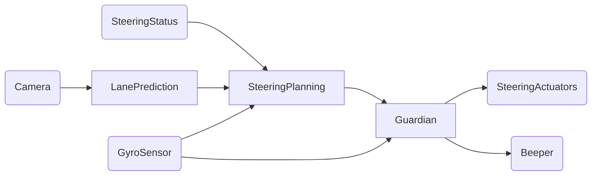

# Engineering AI-Enabled Systems with Interdisciplinary Teams

Christian Kästner

[@p0nk](https://twitter.com/p0nk)

https://ckaestne.github.io/seai/

SEAML'20

---


<!-- split -->
## Christian Kästner

[@p0nk](https://twitter.com/p0nk)

Associate Professor @ CMU

Interests:
* Software Engineering
* Highly-Configurable Systems & Configuration Engineering
* Sustainability and Stress in Open Source
* Software Engineering for ML-Enabled Systems


---

## Software Engineering for ML-Enabled Systems

> Building, operating, and maintaining software systems with machine-learned components

> with interdisciplinary collaborative teams of 
**data scientists** and **software engineers** 


----
## SE for ML-Enabled Systems != Building models


----


## SE for ML-Enabled Systems != coding ML frameworks


----


## SE for ML-Enabled Systems != ML for SE Tools


----
## SE for ML-Enabled Systems


----
## SE for ML-Enabled Systems


[temi.com](https://www.temi.com/)

---

<svg version="1.1" viewBox="0.0 0.0 800 400" xmlns:xlink="http://www.w3.org/1999/xlink" xmlns="http://www.w3.org/2000/svg">
	<style>
    text { font: 60px sans-serif; }
  	</style>
	<circle r="180" cx="180", cy="200" fill="#b9ff00" fill-opacity="0.514" />
	<circle r="180" cx="620", cy="200" fill="#ff5500" fill-opacity="0.514" />
	<text x=180 y=160 dominant-baseline="middle" text-anchor="middle">Data</text>
	<text x=180 y=240 dominant-baseline="middle" text-anchor="middle">Scientists</text>
	<text x=620 y=160 dominant-baseline="middle" text-anchor="middle">Software</text>
	<text x=620 y=240 dominant-baseline="middle" text-anchor="middle">Engineers</text>
</svg>
----
## Software Engineering

> Software engineering is the branch of computer science that creates practical, cost-effective solutions to computing and information processing problems, preferentially by applying scientific knowledge, developing software systems in the service of mankind. 

Engineering judgements under limited information and resources

A focus on design, tradeoffs, and the messiness of the real world

Many qualities of concern: cost, correctness, performance, scalability, security, maintainability, ...


**"it depends..."**


<!-- references -->
Mary Shaw. ed. [Software Engineering for the 21st Century: A basis for rethinking the curriculum](https://www.cs.cmu.edu/~Compose/SEprinciples-pub-rev2.pdf). 2005.


----
## Most ML Courses/Talks

Focus narrowly on modeling techniques or building models

Using notebooks, static datasets, evaluating accuracy

Little attention to software engineering aspects of building complete systems


----
## Data scientist

* Often fixed dataset for training and evaluation (e.g., PBS interviews)
* Focused on accuracy
* Prototyping, often Jupyter notebooks or similar 
* Expert in modeling techniques and feature engineering
* Model size, updateability, implementation stability typically does not matter
* Starting to worry about fairness, robustness, ...

<!-- split -->

## Software engineer

* Builds a product
* Concerned about cost, performance, stability, release time
* Identify quality through customer satisfaction
* Must scale solution, handle large amounts of data
* Plan for mistakes and safeguards
* Maintain, evolve, and extend the product over long periods
* Consider requirements for security, safety, fairness

----

<svg version="1.1" viewBox="0.0 0.0 800 400" xmlns:xlink="http://www.w3.org/1999/xlink" xmlns="http://www.w3.org/2000/svg">
	<style>
    text { font: 60px sans-serif; }
  	</style>
	<circle r="180" cx="180", cy="200" fill="#b9ff00" fill-opacity="0.514" />
	<circle r="180" cx="620", cy="200" fill="#ff5500" fill-opacity="0.514" />
	<text x=180 y=160 dominant-baseline="middle" text-anchor="middle">Data</text>
	<text x=180 y=240 dominant-baseline="middle" text-anchor="middle">Scientists</text>
	<text x=620 y=160 dominant-baseline="middle" text-anchor="middle">Software</text>
	<text x=620 y=240 dominant-baseline="middle" text-anchor="middle">Engineers</text>
</svg>

----


---

# A Software Engineering Perspective on ML

----
## What's different?


* Missing specifications
* Environment is important (feedback loops, data drift)
* Nonlocal and nonmonotonic effects 
* Testing in production
* Data management, versioning, and provenance


----
## Missing Specifications

*from deductive to inductive reasoning*

```java
/**
  ????
*/
String transcribe(File audioFile);
```

```java
/**
  ????
*/
Boolean predictRecidivism(int age, 
                          List<Crime> priors, 
                          Gender gender, 
                          int timeServed,
                          ...);
```

----
## Environment is Important 

*(feedback loops, data drift)*


----
## Nonlocal and Nonmonotonic Effects

*multiple models in most systems*



----
## Testing in production


----
## Data management, versioning, and provenance


<!-- .element: class="stretch" --> 


----
## But Really Different?


----
## ML: Missing Specifications

*from deductive to inductive reasoning*

```java
/**
  ????
*/
String transcribe(File audioFile);
```

```java
/**
  ????
*/
Boolean predictRecidivism(int age, 
                          List<Crime> priors, 
                          Gender gender, 
                          int timeServed,
                          ...);
```

<!-- split -->

## Software Engineering:

vague specs very common

agile methods

safe systems from unreliable components

(["ML is requirements engineering"](https://medium.com/@ckaestne/machine-learning-is-requirements-engineering-8957aee55ef4))

----
## AI: Environment is Important 

*(feedback loops, data drift)*


<!-- split -->

## Software Engineering:

*the world and the machine*


(Jackson ICSE 95)

----
## AI: Nonmonotonic Effects

*multiple models in most systems*


<!-- split -->

## Software Engineering:

*feature interactions*

*system testing*


----
## ML: Testing in production


<!-- split -->

## Software Engineering:

Chaos engineering, A/B testing, continuous deployment, feature flags, canary releases


----
## ML: Data management, versioning, and provenance


<!-- .element: class="stretch" --> 


<!-- split -->

## SE/Database communities:

*stream processing*

*event sourcing*

*data modeling*

*data flow models*

*provenance tracking*


----
## Software Engineers in AI-Enabled System Projects

* Missing specifications -- *implicit, vague specs very common; safe systems from unreliable components* 
* Environment is important -- *the world vs the machine* 
* Nonlocal and nonmonotonic effects -- *feature interactions, system testing* 
* Testing in production -- *continuous deployment, A/B testing*
* Data management, versioning, and provenance -- *stream processing, event sourcing, data modeling*


----
## Examples of Software Engineering Concerns


* How to build robust AI pipelines and facilitate regular model updates? 
* How to deploy and update models in production? 
* How to evaluate data and model quality in production? 
* How to deal with mistakes that the model makes and manage associated risk?
* How to trade off between various qualities, including learning cost, inference time, updatability, and interpretability? 
* How to design a system that scales to large amounts of data? 
* How to version models and data?
* How to manage interdisciplinary teams with data scientists, software engineers, and operators?


----
## My View 

> While developers of simple traditional systems may get away with poor practices, most developers of ML-enabled systems will not.

> This is an education problem, more than a research problem. 


---

<svg version="1.1" viewBox="0.0 0.0 800 400" xmlns:xlink="http://www.w3.org/1999/xlink" xmlns="http://www.w3.org/2000/svg">
	<style>
    text { font: 60px sans-serif; }
  	</style>
	<circle r="180" cx="180", cy="200" fill="#b9ff00" fill-opacity="0.514" />
	<circle r="180" cx="620", cy="200" fill="#ff5500" fill-opacity="0.514" />
	<text x=180 y=160 dominant-baseline="middle" text-anchor="middle">Data</text>
	<text x=180 y=240 dominant-baseline="middle" text-anchor="middle">Scientists</text>
	<text x=620 y=160 dominant-baseline="middle" text-anchor="middle">Software</text>
	<text x=620 y=240 dominant-baseline="middle" text-anchor="middle">Engineers</text>
</svg>


----
## Data Scientists and Software Engineers have Different Roles and Expertise

> that's okay; that's good


----
## Poor Software Engineering Practices in Notebooks?

<!-- colstart -->

<!-- col -->
* 
* Little abstraction
* Global state
* No testing
* Heavy copy and paste
* Little documentation
* Poor version control
* Out of order execution
* Poor development features (vs IDE)
<!-- colend -->

----
## Understanding Benefits of Notebooks

* Data science is exploratory and iterative
    - Science mindset
    - No clear specs, unclear whether possible
* Notebooks offer
    - Quick feedback, similar to REPL
    - Visual feedback
    - Incremental computation
    - Easy to edit and share

<!-- split -->


<small>Source: Patel, Kayur, James Fogarty, James A. Landay, and Beverly Harrison. "[Investigating statistical machine learning as a tool for software development](http://www.kayur.org/papers/chi2008.pdf)." In Proc. CHI, 2008.</small>

----
## Understanding Data Scientist Workflows

* Instead of blindly recommended "SE Best Practices" understand context
* Documentation and testing not a priority in exploratory phase
* Help with transitioning into practice
    * From notebooks to pipelines
    * Support maintenance and iteration once deployed
    * Provide infrastructure and tools


---
# The Software Engineering Mindset

----

[temi.com](https://www.temi.com/)


----
## Thinking about Systems

* Holistic approach, looking at the larger picture, involving all stakeholders
* Looking at relationships and interactions among components and environments
    - Everything is interconnected
    - Combining parts creates something new with emergent behavior
    - Understand dynamics, be aware of feedback loops, actions have effects
* Understand how humans interact with the system

> A system is a set of inter-related components that work together in a particular environment to perform whatever functions are required to achieve the system's objective -- Donella Meadows

<!-- references -->
Leyla Acaroglu. "[Tools for Systems Thinkers: The 6 Fundamental Concepts of Systems Thinking](https://medium.com/disruptive-design/tools-for-systems-thinkers-the-6-fundamental-concepts-of-systems-thinking-379cdac3dc6a)." Blogpost 2017


----
# Four Design Challenges

* **User interaction design**
* Model qualities and deployment tradeoffs
* Risk analysis and safety
* Telemetry design

----
## Designing Intelligent Experiences

<!-- colstart -->
* 
* How to present prediction to a user?
* How to effectively influence the user's behavior toward the system's goal?
* How to minimize the consequences of flawed predictions?
* How to collect data to continue to learn from users and mistakes?


<!-- col -->


<!-- colend -->
----
## Designing Intelligent Experiences

<!-- colstart -->
* 
* How to present prediction to a user?
* How to effectively influence the user's behavior toward the system's goal?
* How to minimize the consequences of flawed predictions?
* How to collect data to continue to learn from users and mistakes?

<!-- col -->

(fall detection)


<!-- colend -->


----
# Four Design Challenges

* User interaction design
* **Model qualities and deployment tradeoffs**
* Risk analysis and safety
* Telemetry design


----
## Beyond Accuracy

* Training time, memory need, model size -- depending on training data volume and feature size
* Inference time, energy efficiency, resources needed, scalability
* Incremental training possible?
* How much data needed? Data quality important? How many features? Interactions among features?
* Interpretability/explainability
* Robustness, reproducibility, stability
* Security, privacy
* Fairness

----
## Trade-offs: Cost vs Accuracy


_"We evaluated some of the new methods offline but the additional
accuracy gains that we measured did not seem to justify the
engineering effort needed to bring them into a production
environment.”_

<!-- references -->

Amatriain & Basilico. [Netflix Recommendations: Beyond the 5 stars](https://netflixtechblog.com/netflix-recommendations-beyond-the-5-stars-part-1-55838468f429),
Netflix Technology Blog (2012)

----
## Architecture: Where should the model live?


<!-- .element: class="stretch" -->


----
# Four Design Challenges

* User interaction design
* Model qualities and deployment tradeoffs
* **Risk analysis and safety**
* Telemetry design


----
## Risk Analysis

> What's the worst that could happen?


----
## Risk Analysis


*  What can possibly go wrong in my system, and what are potential 
impacts on system requirements?
* Risk = Likelihood * Impact
* Many established methods:
  * Failure mode & effects analysis (FMEA)
  * Hazard analysis
  * Why-because analysis
  * Fault tree analysis (FTA)
  * Hazard and Operability Study (HAZOP)
  * ...


----
## The Smart Toaster

<small>$\text{continueToasting}(\text{camera}_\text{initial}, \text{camera}_\text{now}, \text{temperatureReading}, $
$ \text{userPref}) \rightarrow \text{Boolean}$</small>


<!-- .element: class="stretch" -->

> the toaster may (occasionally) burn my toast, but should never burn down my kitchen


----
## Safeguards / Guardrails

* Hard constraints overrule model
    - `heat = (temperatureReading < MAX) && continueToasting(...)`
* External hardware or software failsafe mechanisms
    - outside the model, external observer, e.g., thermal fuses
* Human in the loop


<!-- .element: class="stretch" -->
<small>(Image CC BY-SA 4.0, C J Cowie)</small>


----
# Four Design Challenges

* User interaction design
* Model qualities and deployment tradeoffs
* Risk analysis and safety
* **Telemetry design**


----
## Key Design Challenge: Telemetry

<!-- colstart -->
* How can we identify mistakes? Both false positives and false negatives?
* How can we collect feedback without being intrusive (e.g., asking users about every interactions)?
* How much data are we collecting? Can we manage telemetry at scale? How to sample properly?
* How do we isolate telemetry for specific AI components and versions?


<!-- col -->
Automatic slide design:


<!-- colend -->

----

<!-- split -->


Notes:
Expect only sparse feedback and expect negative feedback over-proportionally


----
## Manually Label Production Samples


----


Notes: Can just wait 7 days to see actual outcome for all predictions
----


Notes: Clever UI design allows users to edit transcripts. UI already highlights low-confidence words, can observe changes in editor (UI design encourages use of editor). In addition 5 star rating for telemetry.

----
## Measuring Model Quality with Telemetry

* Telemetry can provide insights for correctness
    - sometimes very accurate labels for real unseen data
    - sometimes only mistakes
    - sometimes indicates severity of mistakes
    - sometimes delayed
    - often just samples, may be hard to catch rare events
    - often just weak proxies for correctness
* Often sufficient to approximate precision/recall or other measures
* Mismatch to (static) evaluation set may indicate stale or unrepresentative test data
* Trend analysis can provide insights even for inaccurate proxy measures

----
## Engineering Challenges for Telemetry


----
## Software Engineers build Systems

* ML model one component of a larger system
* Understanding the system goals, business case, and success measures
* Requirements and risk analysis
* Architecture, deployment, telemetry
* Automating pipelines at scale
* Continuous delivery and testing in production
* ...

----
<svg version="1.1" viewBox="0.0 0.0 800 400" xmlns:xlink="http://www.w3.org/1999/xlink" xmlns="http://www.w3.org/2000/svg">
    <style>
    text { font: 60px sans-serif; }
    </style>
    <circle r="180" cx="180", cy="200" fill="#b9ff00" fill-opacity="0.514" />
    <circle r="180" cx="620", cy="200" fill="#ff5500" fill-opacity="0.514" />
    <text x=180 y=160 dominant-baseline="middle" text-anchor="middle">Data</text>
    <text x=180 y=240 dominant-baseline="middle" text-anchor="middle">Scientists</text>
    <text x=620 y=160 dominant-baseline="middle" text-anchor="middle">Software</text>
    <text x=620 y=240 dominant-baseline="middle" text-anchor="middle">Engineers</text>
</svg>


---

<svg version="1.1" viewBox="0.0 0.0 800 400" xmlns:xlink="http://www.w3.org/1999/xlink" xmlns="http://www.w3.org/2000/svg">
	<style>
    text { font: 60px sans-serif; }
  	</style>
	<circle r="180" cx="250", cy="200" fill="#b9ff00" fill-opacity="0.514" />
	<circle r="180" cx="550", cy="200" fill="#ff5500" fill-opacity="0.514" />
	<text x=230 y=160 dominant-baseline="middle" text-anchor="middle">Data</text>
	<text x=230 y=240 dominant-baseline="middle" text-anchor="middle">Scientists</text>
	<text x=570 y=160 dominant-baseline="middle" text-anchor="middle">Software</text>
	<text x=570 y=240 dominant-baseline="middle" text-anchor="middle">Engineers</text>
</svg>

----

## Let's Learn from DevOps


Distinct roles and expertise, but joint responsibilities, joint tooling

----
## Toward Better ML-Systems Engineering

Interdisciplinary teams, split expertise, but joint responsibilities

Joint vocabulary and tools

Foster system thinking

Awareness of production quality concerns

Understand goals and requirements, perform risk analysis


----


<svg version="1.1" viewBox="0.0 0.0 800 400" xmlns:xlink="http://www.w3.org/1999/xlink" xmlns="http://www.w3.org/2000/svg">
	<style>
    text { font: 60px sans-serif; }
  	</style>
	<circle r="180" cx="250", cy="200" fill="#b9ff00" fill-opacity="0.514" />
	<circle r="180" cx="550", cy="200" fill="#ff5500" fill-opacity="0.514" />
	<text x=230 y=160 dominant-baseline="middle" text-anchor="middle">Data</text>
	<text x=230 y=240 dominant-baseline="middle" text-anchor="middle">Scientists</text>
	<text x=570 y=160 dominant-baseline="middle" text-anchor="middle">Software</text>
	<text x=570 y=240 dominant-baseline="middle" text-anchor="middle">Engineers</text>
</svg>


---
## Further Readings

All lecture material for "Software Engineering for AI-Enabled Systems": https://ckaestne.github.io/seai/

Annotated bibliography: https://github.com/ckaestne/seaibib


<!-- split -->


---
## Summary: Software Engineering for ML-Enabled Systems

* Building, operating, and maintaining systems with ML component
* Data scientists and software engineers have different expertise, both needed
* Many engineering concerns at the system level:
    - User interaction design
    - Model qualities and deployment tradeoffs
    - Risk analysis and safety
    - Telemetry design
* Interdisciplinary teams, joint vocabulary, and awareness


kaestner@cs.cmu.edu -- [@p0nk](https://twitter.com/p0nk) -- https://ckaestne.github.io/seai/


