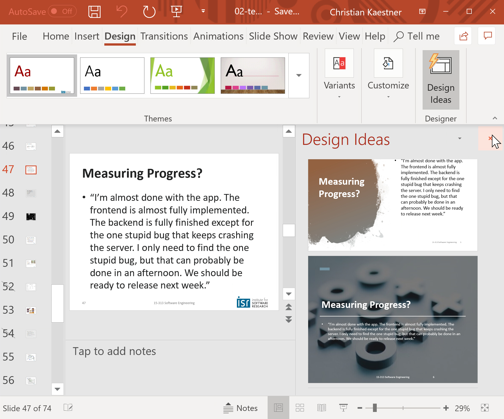
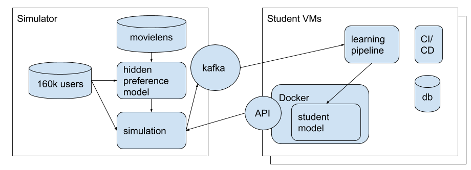

# Teaching Software Engineering for AI-Enabled Systems

Christian Kaestner and Eunsuk Kang

Carnegie Mellon University

https://ckaestne.github.io/seai/

ICSE-SEET 2020

---

## Software Engineering for ML-Enabled Systems

> Building, operating, and maintaining software systems with machine-learned components

---
## SE 4 ML-Systems != Training models

----

## SE 4 ML-Systems != ML 4 SE

----

----

---

<svg version="1.1" viewBox="0.0 0.0 800 400" xmlns:xlink="http://www.w3.org/1999/xlink" xmlns="http://www.w3.org/2000/svg">
    
    <circle r="180" cx="180", cy="200" fill="#b9ff00" fill-opacity="0.514" />
    <circle r="180" cx="620", cy="200" fill="#ff5500" fill-opacity="0.514" />
    <text x=180 y=160 dominant-baseline="middle" text-anchor="middle">Data</text>
    <text x=180 y=240 dominant-baseline="middle" text-anchor="middle">Scientists</text>
    <text x=620 y=160 dominant-baseline="middle" text-anchor="middle">Software</text>
    <text x=620 y=240 dominant-baseline="middle" text-anchor="middle">Engineers</text>
</svg>

----

<svg version="1.1" viewBox="0.0 0.0 800 400" xmlns:xlink="http://www.w3.org/1999/xlink" xmlns="http://www.w3.org/2000/svg">
    
    <circle r="180" cx="250", cy="200" fill="#b9ff00" fill-opacity="0.514" />
    <circle r="180" cx="550", cy="200" fill="#ff5500" fill-opacity="0.514" />
    <text x=230 y=160 dominant-baseline="middle" text-anchor="middle">Data</text>
    <text x=230 y=240 dominant-baseline="middle" text-anchor="middle">Scientists</text>
    <text x=570 y=160 dominant-baseline="middle" text-anchor="middle">Software</text>
    <text x=570 y=240 dominant-baseline="middle" text-anchor="middle">Engineers</text>
</svg>

---
## Many challenges

* Missing specifications
* Environment is important (feedback loops, data drift)
* Nonlocal and nonmonotonic effects 
* Testing in production
* Data management, versioning, and provenance
* Fairness, robustness, interpretability

----
## Software Engineers Can Contribute

* Missing specifications -- *implicit, vague specs very common; safe systems from unreliable components, risk analysis* <small>(["ML is requirements engineering"](https://medium.com/@ckaestne/machine-learning-is-requirements-engineering-8957aee55ef4))</small>
* Environment is important -- *the world vs the machine* <small>([paper](https://courses.cs.washington.edu/courses/csep503/19wi/schedule/papers/TheWorldAndTheMachine.pdf))</small>
* Nonlocal and nonmonotonic effects -- *feature interactions, system testing* 
* Testing in production -- *continuous deployment, A/B testing*
* Data management, versioning, and provenance -- *stream processing, event sourcing, data modeling*
* Fairness, robustness, interpretability -- *traditional requirements engineering questions*

----

https://github.com/ckaestne/seai

----
## Our View

> While developers of simple traditional systems may get away with poor practices, most developers of AI-enabled systems will not.

> This is an education problem, more than a research problem. 

---
## Assignments

Break the habit of modeling in notebooks on static datasets

Design for realistic "production" setting: deployment, experimentation in production, data drift and feedback loops

Movie recommendations for 1 million simulated users in real time

---
## Summary: Software Engineering for ML-Enabled Systems

* Building, operating, and maintaining systems with ML component
* Data scientists and software engineers have different expertise, both needed
* Software engineering view on intelligent *systems*:
    - User interaction design
    - Model qualities and deployment tradeoffs
    - Risk analysis and safety
    - Architecture, deployment, telemetry design
    - Quality assurance, fairness, robustness, interpretability
* All material, including slides, assignments, video recordings, shared under Creative Commons license

https://ckaestne.github.io/seai/
